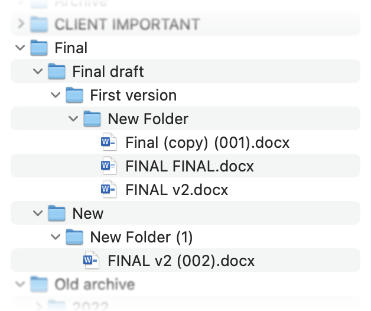

# Manifeste de l'Ingénierie en tant que Code

Nous sommes des ingénieurs brillants—experts en thermodynamique, mécanique, simulations et conception. Pourtant, jour après jour, nous nous débattons avec des documents Word, des feuilles de calcul Excel et des chaînes d'e-mails sans fin. Nous dupliquons des fichiers, perdons la trace des révisions et passons plus de temps à suivre les demandes de modification qu'à innover.

??? note "Le cauchemar de l'ingénieur"
    

    Bouuh !

Il est temps de nous réapproprier notre métier et de transformer notre façon de travailler.

L'ingénierie devrait être à propos de :
- Penser avec un papier et un stylo
- Convertir cette pensée en code
- S'appuyer sur le travail des autres
- **Ne tout faire qu'une seule fois**

---

## Adoptez la collaboration versionnée

* **Arrêtez d'envoyer par e-mail “rapport_v2_final_rev.xlsx”**
  Au lieu de cela, centralisez les fichiers de conception, les scripts et la documentation dans un dépôt Git.
* **Chaque changement est traçable.**
  Les Pull Requests deviennent nos revues par les pairs—fini de deviner qui a modifié quoi, quand et pourquoi.

## Ingénierie avec du code

* **Paramétrez tout.**
  Passez des mises à jour manuelles de tableaux à des modèles pilotés par le code. Modifiez un paramètre de simulation une seule fois et laissez les pipelines automatisés régénérer les résultats, les diagrammes et les rapports.
* **Automatisez le banal.**
  Créez des flux de travail CI/CD avec GitHub Actions : exécutez des tests, générez de la documentation, notifiez les parties prenantes—sans lever le petit doigt.

## Tirez parti de l'IA de pointe

* **Des assistants intelligents à vos côtés.**
  Utilisez des agents IA (RAG, LangChain, SmolAgents) pour rédiger des scripts de simulation, valider les conditions aux limites ou résumer les résultats d'analyse.
* **La perspicacité plutôt que la boîte de réception.**
  Plutôt que de passer au crible des dizaines de fils de discussion, demandez à un agent IA le dernier état du projet et obtenez un briefing consolidé et instantané.

## Gardez les données pures et réutilisables

* **Un monorepo pour les modèles et la documentation.**
  Centralisez tous les actifs—simulations, exportations CAO, rapports—en un seul endroit. Des données propres et versionnées signifient moins d'erreurs et une intégration plus rapide.
* **Interopérabilité par conception.**
  Créez des connecteurs personnalisés qui alimentent directement vos sorties de simulation dans les flux de travail IA, les tableaux de bord et les outils en aval.

## Favorisez une culture d'amélioration continue

* **Apprenez en partageant.**
  Chaque ingénieur contribue aux bibliothèques partagées—scripts pour le maillage, routines de post-traitement ou modèles de visualisation de données.
* **Itérez rapidement.**
  Avec des pipelines légers, lancez de nouvelles idées en quelques minutes, pas en quelques jours. Échouez vite, apprenez plus vite et repoussez les limites du possible.