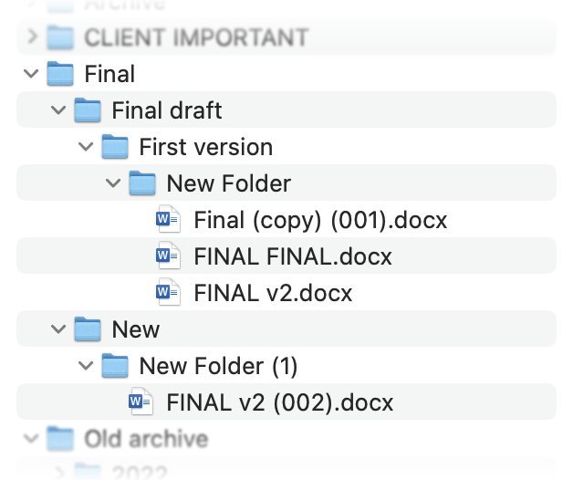

# Engineering-as-Code Manifesto

We are brilliant engineers—experts in thermodynamics, mechanics, simulations, and design. Yet day after day, we wrestle with Word documents, Excel spreadsheets, and endless email chains. We duplicate files, lose track of revisions, and spend more time tracking change requests than innovating.

??? note "The Engineer's Nightmare"
    

    Boo!

It’s time to reclaim our craft and transform how we work.

Engineering should be about:
- Paper-and-pen thinking
- Converting thoughts into code
- Building on the work of others
- **Doing everything once**

---

## Embrace Versioned Collaboration

* **Stop emailing “report_v2_final_rev.xlsx”**
  Instead, keep design files, scripts, and documentation together in a Git repository.
* **Every change is traceable.**
  Pull requests become our peer reviews—no more guessing who changed what, when, and why.

## Engineer with Code

* **Parameterize everything.**
  Shift from manual table updates to code-driven models. Change a simulation parameter once, and let automated pipelines regenerate results, diagrams, and reports.
* **Automate the mundane.**
  Build CI/CD workflows with GitHub Actions: run tests, generate documentation, and notify stakeholders—without lifting a finger.

## Leverage State-of-the-Art AI

* **Smart assistants at your side.**
  Use AI agents (RAG, LangChain, SmolAgents) to draft simulation scripts, validate boundary conditions, or summarize analysis results.
* **Insight over inbox.**
  Instead of sifting through dozens of email threads, ask an AI agent for the latest project status and get an instant, consolidated briefing.

## Keep Data Pure & Reusable

* **Monorepo for models & docs.**
  Centralize all assets—simulations, CAD exports, reports—in one place. Clean, versioned data means fewer errors and faster onboarding.
* **Interoperability by design.**
  Build custom connectors that feed your simulation outputs straight into AI workflows, dashboards, and downstream tools.

## Foster a Culture of Continuous Improvement

* **Learn by sharing.**
  Every engineer contributes to shared libraries—scripts for meshing, post-processing routines, or data-visualization templates.
* **Iterate rapidly.**
  With lightweight pipelines, spin up new ideas in minutes, not days. Fail fast, learn faster, and push the boundaries of what’s possible.

