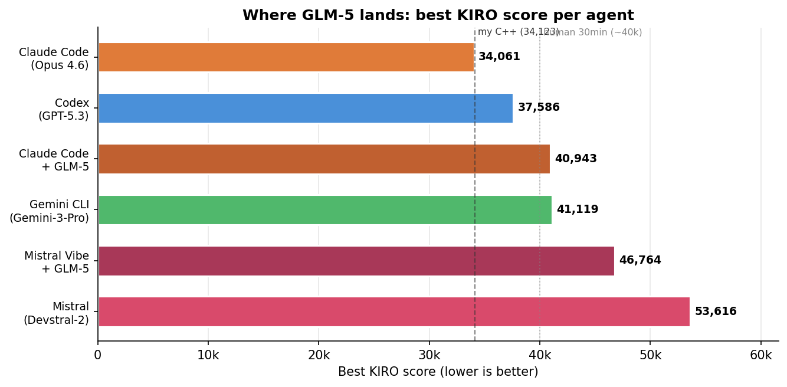
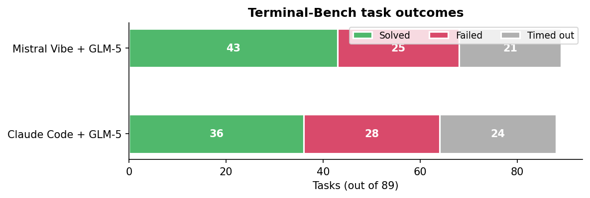
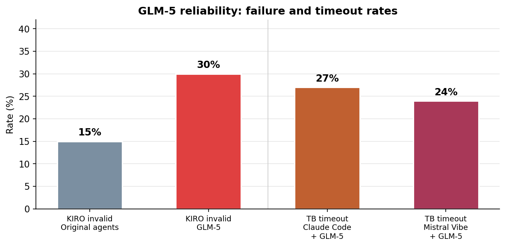
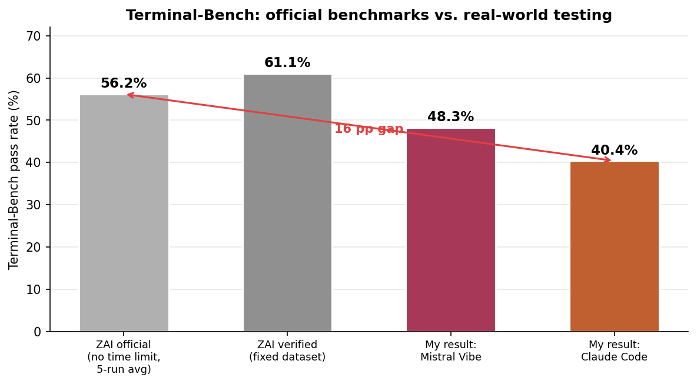

**TL;DR:** GLM-5 tops coding benchmarks. I tested it on an unpublished NP-hard optimization problem (KIRO) and 89-task Terminal-Bench. Best case: competitive. Typical case: 30% invalid output, every trial timed out, and two identical runs could produce a valid solution or complete garbage. Zhipu AI reports 56% on Terminal-Bench; I got 40%.

Original repository: [CLIArena](https://github.com/charles-azam/CLIArena)

---

## The pitch

GLM-5, from Zhipu AI, is an open-source (MIT) model claiming [77.8% on SWE-bench Verified and 56.2% on Terminal-Bench 2.0](https://z.ai/). Its API is Anthropic/OpenAI-compatible, so you can plug it into existing agent frameworks. And Zhipu AI's Coding Plan subscription ($60/month, extremely generous token limits) makes it cheap to burn tokens at scale -- ideal for systematic testing.

I ran two benchmarks: KIRO, an unpublished NP-hard fiber optic network optimization problem that I'm certain is not in any training data, and Terminal-Bench, a public 89-task coding benchmark. I wanted to see if the numbers hold up.

## How I tested GLM-5

I ran GLM-5 through two agent frameworks (scaffoldings):

- **Claude Code** -- Anthropic's CLI agent. Point it at the API endpoint, set the model name, go. The "official" way to run a model through an agent.
- **Mistral Vibe** -- my fork of Mistral's Vibe CLI, adapted for GLM-5. In previous testing, Mistral Vibe was the easiest codebase to fork and showed the strongest results across frameworks on Terminal-Bench. [Mistral-vibe-zai](https://github.com/charles-azam/mistral-vibe-zai)

Both frameworks ran on the same two benchmarks:

**KIRO** -- an NP-hard fiber optic network optimization problem I solved by hand eight years ago as an engineering student. Never published online, returns a continuous score (lower is better) instead of pass/fail. In a [previous article](https://charlesazam.com/blog/kiro-benchmark/), I ran four CLI agents on it (Claude Code/Opus 4.6, Codex/GPT-5.3, Gemini CLI, Mistral/Devstral-2). Same five conditions (base, +keep improving, +target hint, Go, one hour), three trials each, same Docker containers via [Harbor](https://github.com/laude-institute/harbor).

**Terminal-Bench** -- an 89-task coding benchmark covering everything from building POV-Ray to COBOL modernization to cracking 7z hashes. [Terminal-Bench](https://github.com/laude-institute/terminal-bench)

## The headline numbers look fine

On KIRO, GLM-5 slots into the middle of the pack -- competitive but not at the top. Claude Code + GLM-5 (40,943) lands right next to Gemini CLI (41,119). Mistral Vibe + GLM-5 (46,764) comfortably beats Devstral-2 (53,616).

On Terminal-Bench, Mistral Vibe + GLM-5 solved 43 out of 89 tasks (48.3%). Claude Code + GLM-5 solved 36 out of 88 (40.4%). These are respectable numbers. If I stopped here, I'd write "GLM-5 is competitive."

I didn't stop here.

## The numbers behind the numbers

**30% of KIRO trials produced completely invalid output.** Out of 27 completed trials, 8 scored 999,999,999 (the penalty for constraint violations). For comparison, the original four agents failed on 15% of trials. Every single experimental condition -- base, keep improving, target hint, Go, one hour -- produced at least one failure for both frameworks.

**Every single KIRO trial hit the timeout.** Even the valid ones. The agents were always interrupted mid-work, never finishing cleanly. With the original agents, several trials completed well within the time limit -- Gemini CLI often finished in under 5 minutes of a 30-minute window. GLM-5 never did.

**Variance was insane.** Two runs of the exact same condition could produce a valid solution or complete garbage. Claude Code + GLM-5's target hint trials: 58,045 and 999,999,999 (invalid). With the original agents, variance within a condition was typically under 30%.

**The Go condition was catastrophic.** Claude Code + GLM-5's Go run had to be cancelled entirely after the first trial scored 999,999,999 and the second had to be force-killed mid-run. Mistral Vibe + GLM-5 Go trials scored 296,978 (valid but abysmal), 999,999,999 (invalid), and 97,539. The agents spent their time writing and rewriting Go code, not optimizing.

**On Terminal-Bench, nearly a quarter of tasks timed out.** Claude Code + GLM-5 timed out on 24 of 88 tasks (27%). Mistral Vibe + GLM-5 timed out on 21 of 89 (24%).

### Why my Terminal-Bench scores differ from Zhipu AI's

Zhipu AI [reports 56.2% on Terminal-Bench with Claude Code](https://zhipuai.cn/) -- or 61.1% on their verified dataset. I got 40.4%. That's a massive gap for the same model on the same benchmark. The difference comes down to testing conditions, and reading the footnotes of their blog post explains most of it:

- **No wall-clock time limits.** Zhipu AI's evaluation "remove[s] wall-clock time limits, while preserving per-task CPU and memory constraints." My benchmark has real time limits -- the same ones any user would face. Given that 27% of my Claude Code tasks timed out, removing time limits alone could explain most of the gap.
- **API access vs. Coding Plan subscription.** I used the Coding Plan subscription ($60/month). Subscription requests are slower than direct API calls -- a request that takes a few extra seconds cascades into fewer iterations within the same time window. Zhipu AI's evaluation likely used their own infrastructure with no such bottleneck.
- **Verified dataset.** Zhipu AI also reports results on "a verified Terminal-Bench 2.0 dataset that resolves ambiguous instructions," which boosted their score from 56.2% to 61.1%.
- **Think mode with tuned parameters.** They used Claude Code 2.1.14 in think mode with temperature=1.0, top_p=0.95, max_new_tokens=65536. My runs used default settings through the Coding Plan.

None of this is dishonest -- Zhipu AI discloses their methodology in the footnotes. But it means their headline number (56-61%) represents ideal conditions that a typical user with a Coding Plan subscription won't replicate. My 40.4% is closer to what you'd actually experience.

## What the trajectories show

I read through the agent traces. GLM-5 isn't dumb -- it knows the right algorithms and approaches the problem sensibly. The issue is execution depth and reliability.

**Claude Code + GLM-5** took 90 steps in its best run (40,943, one-hour condition). It went through six solver versions, starting at 97,796 and iterating down through multiple approaches -- basic heuristics, multi-start methods, MST-based chains, k-means clustering. But it hit a plateau:

> "The solver is consistently getting 40943. Let me run a few more times and then summarize."

Compare this to Claude Code + Opus 4.6, which in its best run wrote and rewrote its solver four times, invented a destroy-and-repair perturbation strategy to escape local minima, and kept finding improvements all the way down to 34,061. GLM-5 identified the right general approach but couldn't push through to the next level of sophistication.

**Mistral Vibe + GLM-5** was faster but shallower -- 34 steps versus 90. It tried multiple construction heuristics with 2-opt improvement and iterated aggressively (81,397 → 58,544 → 46,764), but ran out of time before closing the gap. With only 34 steps, it simply couldn't iterate enough. This is not surprising, it is a very simple tool with simple prompts (simple is usually better).

## The framework matters

An interesting side-finding: the same model produced different results depending on which agent framework ran it.

| Benchmark | Claude Code + GLM-5 | Mistral Vibe + GLM-5 |
|---|---|---|
| KIRO (best) | **40,943** | 46,764 |
| Terminal-Bench | 36/88 (40.4%) | **43/89 (48.3%)** |

Claude Code's deeper iteration loop helped on the sustained optimization problem (KIRO). Mistral Vibe's lighter approach won on diverse task completion (Terminal-Bench). The two agents solved different subsets of Terminal-Bench tasks: 30 tasks solved by both, 13 uniquely by Mistral Vibe, 6 uniquely by Claude Code.

The agent around the model shapes how its intelligence gets applied. Same weights, different results.

## What this means

GLM-5 is not a bad model. Its best-case KIRO score of 40,943 is genuinely competitive with Gemini CLI. It knows the right algorithms, approaches problems sensibly, and through the right framework can solve a decent range of coding tasks.

But competitive best-case performance is not the same as reliable performance. The original agents -- each running their native model -- had a 15% invalid rate on KIRO. GLM-5 had 30%. The original agents sometimes finished early. GLM-5 always timed out. The original agents had moderate variance. GLM-5's variance was wild.

This is the gap that standard benchmarks don't capture. SWE-bench tells you the pass rate across a curated set of tasks. Terminal-Bench with no time limits tells you what's possible under ideal conditions. Neither tells you that a third of your real runs might produce garbage, or that two identical runs can produce a valid solution or nonsense, or that the model will always run out of time even on tasks where competitors finish in minutes.

Zhipu AI reports 56-61% on Terminal-Bench. I got 40%. Both numbers are real -- they just measure different things. Theirs measures the model's ceiling. Mine measures the user's floor.

When I pick a model for real work, I don't care about the best score on the best day. I care about the worst score on a normal day. By that metric, GLM-5 has a way to go.

## Another reason why it failed

In a [separate article](https://charlesazam.com/blog/deepdive-benchmark/), I found that agents handle file editing in wildly different ways: custom patch DSLs, SEARCH/REPLACE blocks, 9-strategy fuzzy matching cascades, LLM-based self-correction fallbacks. Each format works well for the model fine-tuned on it -- Codex's patches are trained into GPT, Claude Code's edit tool is trained into Claude. A general-purpose model like GLM-5 sees these formats cold in the system prompt. When it produces a slightly malformed edit, the agent retries, tokens burn, and the clock runs out.

GLM-5 is open-source (MIT License, weights on HuggingFace) -- which means this is fixable. The agent scaffolding is the fine-tuning surface. Generate trajectories through your own agent loop, fine-tune the model on them. The reason native models work so well in their native agents isn't just model quality -- it's that the model has been trained on the exact interface it uses in production. The gap between 40% and 60% on Terminal-Bench might not require a better model -- just one fine-tuned on the agent it runs in.

## Raw data

All task definitions, verifiers, trajectories, and raw results: [CLIArena](https://github.com/charles-azam/CLIArena). The benchmark runs on [Harbor](https://github.com/laude-institute/harbor).

### KIRO scores (all trials)

**Claude Code + GLM-5:**

| Condition | Trial 1 | Trial 2 | Trial 3 |
|---|---|---|---|
| Base | 55,664 | invalid | 56,479 |
| + keep improving | invalid | 50,666 | 59,673 |
| + target hint | invalid | 68,571 | 58,045 |
| Go | cancelled | cancelled | cancelled |
| 60min Python | invalid | **40,943** | 56,175 |

**Mistral Vibe + GLM-5:**

| Condition | Trial 1 | Trial 2 | Trial 3 |
|---|---|---|---|
| Base | 51,961 | 55,765 | invalid |
| + keep improving | 53,014 | 48,243 | invalid |
| + target hint | 47,652 | **46,764** | 82,434 |
| Go | 296,978 | invalid | 97,539 |
| 60min Python | 147,418 | 57,260 | invalid |

---

*Disclosure: I have no relationship with Zhipu AI, Anthropic, OpenAI, Google, or Mistral. I pay for subscriptions like everyone else. The benchmark tasks are novel and have never been published before this article. Take this as one data point from one person running one set of tests.*
